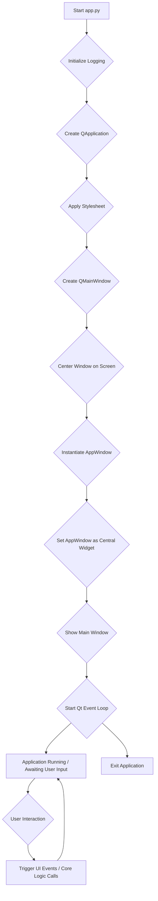

# `app.py` Process Flow Analysis

## 1. Introduction

`app.py` serves as the main entry point and orchestrator for the LOGIK-PROJEKT application. Its primary responsibility is to initialize the PySide6 GUI environment, set up the main application window, integrate all UI components, and manage the application's event loop. It acts as the central hub that brings together the user interface and the core application logic.

## 2. High-Level Overview

The execution of `app.py` follows a sequential flow:

1.  **Initialization**: Sets up logging, creates the QApplication instance, and applies the application-wide stylesheet.
2.  **Main Window Setup**: Configures the `QMainWindow` and centers it on the screen.
3.  **UI Integration**: Instantiates the `AppWindow` (which contains all the panels and widgets) and sets it as the central widget of the `QMainWindow`.
4.  **Execution**: Starts the PySide6 event loop, allowing the application to respond to user interactions.

## 3. Detailed Process Flow

### 3.1. Application Initialization

When `app.py` is executed, the `main()` function is called:

*   **Logging Configuration**: A root logger is configured for console output, and a `FileHandler` is added to create session-specific log files in `logs/session-logs/YYYY/MM/DD/`. It also sets the root logger's level to `logging.DEBUG`. *Note: While `app.py` sets up this basic file logging, the `AppWindow` then adds its own handler for thread-safe logging to the UI.*
*   **`QApplication` Instance**: A `QApplication` instance is created, which is essential for any PySide6 application as it manages the GUI application's control flow and main settings.
*   **Stylesheet Application**: The application's visual theme is applied by setting the stylesheet using `LogikProjektModularTheme.get_stylesheet()`.

### 3.2. User Interface Setup

*   **`QMainWindow` Creation**: A `QMainWindow` is instantiated, serving as the top-level window for the application. Its title is set to "LOGIK-PROJEKT 2026.1".
*   **Window Positioning**: The `QMainWindow` is centered on the primary screen, taking into account `ui_config.WINDOW_WIDTH` and `ui_config.WINDOW_HEIGHT`. If no primary screen is found, it defaults to a fixed position.
*   **`AppWindow` Instantiation**: The core of the application's UI, `AppWindow` (defined in `src/ui/app_window.py`), is instantiated. This `AppWindow` is a `QWidget` that contains all the individual panels and their respective widgets.
*   **Central Widget Assignment**: The `AppWindow` instance is set as the central widget of the `QMainWindow`, making it the primary content area of the main window.

### 3.3. Event Handling and User Interaction

While `app.py` itself doesn't directly handle individual widget events, it sets up the `AppWindow` which is responsible for this.

*   **Signal-Slot Connections**: Within `AppWindow`, various signals from UI widgets (e.g., button clicks, text changes, combobox selections) are connected to corresponding slots (methods) within `AppWindow` or its child panels.
*   **Worker Thread**: `AppWindow` utilizes a `QThread` and a `Worker` QObject to perform long-running operations (like template export/import or project creation) in a separate thread, preventing the UI from freezing. Signals (`create_projekt_requested`, `export_template_requested`, `import_template_requested`) are emitted from `AppWindow` and connected to slots on the `Worker` object.
*   **UI Updates**: User interactions trigger methods like `_update_all_summaries` in `AppWindow`, which in turn retrieve data from various panels and update the `TemplateSummaryPanel` and `ProjektSummaryPanel`.

### 3.4. Core Logic Integration (`src/core/app_logic.py`)

`app.py` indirectly integrates with `src/core/app_logic.py` through the `AppWindow`.

*   **`AppLogic` Instance**: An `AppLogic` instance is created within `AppWindow`.
*   **Data Retrieval**: UI panels (e.g., `TemplateInfoPanel`, `TemplateParametersPanel`, `FlameOptionsPanel`) provide their collected data to `AppWindow`.
*   **`get_projekt_summary_data`**: `AppWindow` calls `self.app_logic.get_projekt_summary_data()` to consolidate data from template info, template parameters, and Flame options into a comprehensive project summary.
*   **`export_logik_projekt_template`**: When the export button is clicked, `AppWindow`'s `_export_template_json` method validates the data and then emits a signal that triggers `self.worker.export_template_json`, which in turn calls `self.app_logic.export_logik_projekt_template`.
*   **`import_logik_projekt_template`**: Similarly, the import button triggers `_import_template_json`, which emits a signal to `self.worker.import_template_json`, calling `self.app_logic.import_logik_projekt_template`.
*   **`create_projekt`**: The "Create PROJEKT" button in `ProjektSummaryPanel` triggers `_create_projekt` in `AppWindow`, which validates data and then emits a signal to `self.worker.create_projekt`, which calls the `create_projekt` function (imported directly into `AppWindow` from `src/core/projekt_manager/projekt_creator.py`).

### 3.5. Data Flow and State Management

Data flows primarily from the individual input panels (`TemplateInfoPanel`, `TemplateParametersPanel`, `FlameOptionsPanel`) to the summary panels (`TemplateSummaryPanel`, `ProjektSummaryPanel`) and then to the `AppLogic` for processing.

*   **Panel Data Retrieval**: Methods like `get_template_info()`, `get_template_parameters()`, and `get_flame_options()` are used to retrieve the current state of data from the UI panels.
*   **Combined Data**: This data is often combined into dictionaries or dataclass instances (e.g., `TemplateInfo`, `TemplateParameters`) before being passed to `AppLogic` functions.
*   **Summary Updates**: The `_update_all_summaries()` method in `AppWindow` is crucial for keeping the summary panels synchronized with user input.

### 3.6. Application Execution Loop

*   **`app.exec_()`**: The final step in `main()` is `sys.exit(app.exec_())`. This starts the PySide6 event loop, which continuously monitors for events (user input, system events, etc.) and dispatches them to the appropriate widgets and slots. The application remains active until the event loop is terminated (e.g., by closing the main window).

### 3.7. Flame Startup Script and Workspace Generation

Recent developments have refined how the application interacts with Autodesk Flame, specifically concerning the generation and consumption of startup scripts and workspace configurations.

*   **`create_flame_startup_script.py`**: This script is responsible for generating `flame_startup_script.py` within the Flame project's `setups/scripts/startup/` directory. A key enhancement ensures that the absolute path to `flame-workspace.json` is directly embedded into the generated Python startup script. This eliminates path resolution issues within the Flame environment, ensuring the script can always locate its configuration data.

*   **`flame-workspace.json` Validation**: The `create_flame_startup_script.py` now includes robust validation for `flame-workspace.json`. It strictly enforces that the JSON content must be a list of dictionaries, preventing `AttributeError` issues that previously occurred when Flame attempted to parse malformed workspace data. This ensures the structural integrity of the workspace definition consumed by Flame.

*   **`create_flame_launcher_script.py`**: This script generates `flame_launcher_script.sh`, which is used to launch Flame. It has been updated to correctly reference `flame_startup_script.py` using its full relative path (`scripts/startup/flame_startup_script.py`) within the Flame project's `setups/` directory. This correction ensures that the launcher script directs Flame to the precise location of the Python startup script.

## 4. Dependencies and Interactions

`app.py` directly or indirectly relies on the following key modules:

*   `src.ui.app_window.py`: Defines the main application widget, layout, and panel integration.
*   `src.ui.ui_config.py`: Provides constants for UI dimensions and layout.
*   `src.ui.themes.modular_dark_theme.py`: Supplies the application's visual stylesheet.
*   `src.ui.panels.*`: All individual UI panels (e.g., `template_info_panel.py`, `template_parameters_panel.py`, `flame_options_panel.py`, `projekt_template_panel.py`, `template_summary_panel.py`, `projekt_summary_panel.py`).
*   `src.core.app_logic.py`: Contains the core business logic for template management and project creation.
*   `src.core.projekt_manager.projekt_creator.py`: Handles the actual creation of the LOGIK-PROJEKT.
*   `src.core.template_manager.template_models.py`: Defines data models for template information and parameters.
*   `src.core.utils.threaded_logging_utils.py`: Provides utilities for thread-safe logging.
*   `src.core.utils.validation_utils.py`: Used for validating user inputs before export or project creation.
